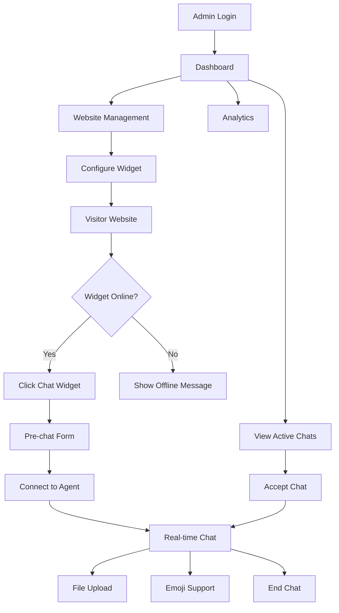

## 1. Product Overview
Helpdesk Customer Support Widget System - A real-time customer support platform that enables businesses to provide instant chat support through embeddable widgets on their websites. Similar to Tawk.to or Crisp, this system provides a complete support solution with admin dashboard and customer-facing chat widgets.

The platform solves the problem of customer support scalability by providing real-time chat capabilities, visitor tracking, and comprehensive analytics while maintaining a simple embed-and-go approach for website owners.

## 2. Core Features

### 2.1 User Roles
| Role | Registration Method | Core Permissions |
|------|---------------------|------------------|
| Super Admin | Manual creation only | Full system access, create/delete admins, manage all websites, view all analytics |
| Admin/Support Agent | Super Admin invitation | Manage assigned websites, handle chats, view analytics, internal notes |
| Website Visitor | No registration required | Initiate chats, upload files, view chat history |

### 2.2 Feature Module
Our helpdesk system consists of the following main components:

**Admin Dashboard (Web A):**
1. **Authentication Portal**: Login page, role-based access control, JWT authentication
2. **Dashboard Overview**: Real-time visitor count, chat statistics, agent performance metrics
3. **Website Management**: Add/edit websites, API key generation, domain validation, widget settings
4. **Chat Interface**: Real-time messaging, chat assignment, internal notes, file sharing
5. **Analytics Dashboard**: Visitor statistics, chat performance, agent metrics, response time tracking
6. **Admin Management**: Create/delete admin accounts, role assignment, permission management

**Customer Widget (Web B):**
1. **Chat Widget**: Floating chat bubble, unread message counter, typing indicators
2. **Visitor Interface**: Name/email form, chat history, file upload, emoji support
3. **Session Management**: Persistent sessions, offline messaging, auto-reply configuration

### 2.3 Page Details
| Page Name | Module Name | Feature description |
|-----------|-------------|---------------------|
| Login Page | Authentication Form | Validate admin credentials, JWT token generation, redirect to dashboard |
| Dashboard Overview | Statistics Panel | Display real-time visitor count, active chats, total conversations, average response time |
| Dashboard Overview | Quick Actions | Quick access to active chats, pending assignments, recent visitors |
| Website Management | Website List | View all websites, status toggle, API key management, quick settings access |
| Website Management | Add Website Form | Input website details, generate unique API key, configure domain whitelist |
| Website Management | Widget Settings | Customize widget appearance, position, colors, welcome messages, business hours |
| Chat Interface | Active Chats List | View all ongoing conversations, filter by status, assign to agents |
| Chat Interface | Chat Window | Real-time messaging with Socket.io, typing indicators, file upload, chat history |
| Chat Interface | Chat Controls | Change chat status, assign to agent, add internal notes, mark as resolved |
| Analytics Dashboard | Visitor Analytics | Track unique visitors, page views, session duration, geographic data |
| Analytics Dashboard | Chat Analytics | Total chats, resolution rate, average response time, peak hours analysis |
| Analytics Dashboard | Agent Performance | Response time per agent, chat volume, resolution rate, customer satisfaction |
| Admin Management | Admin List | View all system admins, filter by role, edit permissions, deactivate accounts |
| Admin Management | Create Admin Form | Add new admin accounts, assign roles, set permissions, send invitation emails |
| Chat Widget | Widget Launcher | Floating chat bubble with unread counter, position configuration, auto-hide behavior |
| Chat Widget | Pre-chat Form | Collect visitor name and email before starting chat, optional configuration |
| Chat Widget | Chat Interface | Send/receive messages, typing indicators, file upload, emoji picker, chat history |
| Chat Widget | Offline Mode | Display offline status, show auto-reply message, collect offline messages |

## 3. Core Process

### Super Admin Flow
1. Login to admin dashboard using credentials
2. Create admin/support agent accounts with appropriate roles
3. Add new website with domain details and generate API key
4. Configure widget settings (appearance, position, messages)
5. Monitor system-wide analytics and agent performance
6. Manage all websites and their configurations

### Admin/Support Agent Flow
1. Login to admin dashboard with assigned credentials
2. View assigned websites and their active chats
3. Accept incoming chat requests and engage with visitors
4. Use internal notes for team collaboration
5. Upload files and share with visitors when needed
6. Mark conversations as resolved after completion
7. View analytics for assigned websites only

### Website Visitor Flow
1. Visit website with embedded widget
2. See floating chat bubble with online/offline status
3. Click chat bubble to open widget
4. Fill name/email form (if required)
5. Start conversation with support agent
6. Receive real-time responses with typing indicators
7. Upload files if needed for support
8. Chat continues across page navigation via session persistence
9. Receive offline message if no agents available

## 4. User Interface Design

### 4.1 Design Style
- **Primary Colors**: Professional blue (#2563eb) for primary actions, gray (#6b7280) for secondary elements
- **Secondary Colors**: Green (#10b981) for success states, red (#ef4444) for errors, yellow (#f59e0b) for warnings
- **Button Style**: Rounded corners (8px radius), clear hover states, consistent padding (12px 24px)
- **Typography**: Inter font family, 16px base size, clear hierarchy with H1-H6 sizes
- **Layout Style**: Card-based design with subtle shadows, consistent spacing (8px grid system)
- **Icons**: Heroicons for consistency, outline style for clarity
- **Animations**: Smooth transitions (200ms), fade-in effects for modals, typing indicator animations

### 4.2 Page Design Overview
| Page Name | Module Name | UI Elements |
|-----------|-------------|-------------|
| Login Page | Authentication Form | Centered card layout, gradient background, clean input fields, prominent login button |
| Dashboard Overview | Statistics Panel | Grid layout with metric cards, real-time counters, sparkline charts, color-coded indicators |
| Website Management | Website List | Table format with status badges, action buttons, search/filter controls, pagination |
| Chat Interface | Chat Window | Split-pane layout, conversation list sidebar, main chat area with message bubbles |
| Analytics Dashboard | Charts Section | Responsive chart containers, date range picker, export buttons, interactive tooltips |
| Chat Widget | Widget Launcher | Circular floating button, subtle shadow, smooth animations, unread badge overlay |
| Chat Widget | Chat Interface | Mobile-optimized design, full-screen on mobile, compact message bubbles, attachment button |

### 4.3 Responsiveness
- **Desktop-first approach**: Optimized for 1920x1080 and 1366x768 resolutions
- **Mobile adaptation**: Responsive breakpoints at 768px and 480px
- **Touch optimization**: Larger tap targets on mobile, swipe gestures for chat navigation
- **Widget positioning**: Bottom-right default, adapts to viewport size, collapses on small screens

### 4.4 Widget Design Specifications
- **Default Position**: Bottom-right corner with 20px margin
- **Widget Size**: 60px diameter collapsed, 380px x 500px expanded (desktop)
- **Color Customization**: Primary color applies to header and send button
- **Animation**: Smooth expand/collapse with spring physics, typing indicator with pulse effect
- **Accessibility**: Keyboard navigation support, screen reader compatibility, high contrast mode